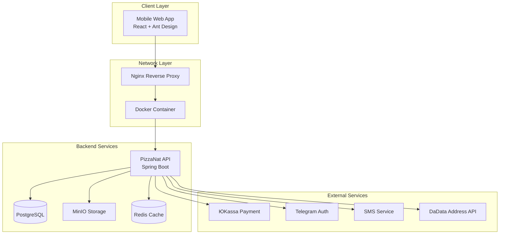
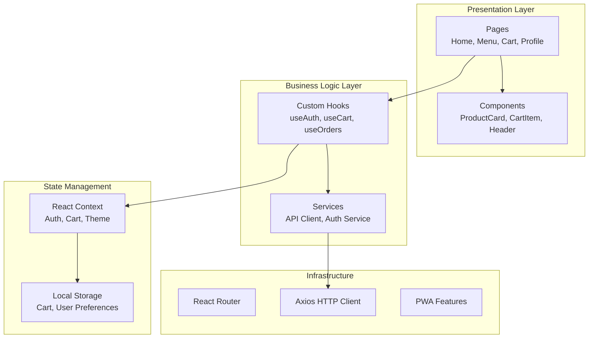

/**
 * @file: Project.md
 * @description: Основная документация проекта PizzaNat Web - мобильное веб-приложение для заказа пиццы
 * @dependencies: Backend API PizzaNat, Ant Design, React.js
 * @created: 2025-01-07
 */

# PizzaNat Web - Мобильное веб-приложение

## 📋 Обзор проекта

**PizzaNat Web** - это мобильное веб-приложение для заказа пиццы, полностью повторяющее дизайн и функциональность Android-приложения PizzaNat. Проект создан как альтернатива iOS-приложению, обеспечивая единообразный пользовательский опыт на всех платформах.

### 🎯 Цели проекта

1. **Основная цель**: Создать мобильное веб-приложение, идентичное по дизайну Android-приложению
2. **Техническая цель**: Интегрировать все возможности существующего backend API
3. **Бизнес-цель**: Обеспечить доступность сервиса для пользователей iOS без разработки нативного приложения
4. **Архитектурная цель**: Создать масштабируемое и поддерживаемое решение

## 🏗️ Архитектура системы

### Системная архитектура



### Компонентная архитектура фронтенда



## 🛠️ Технологический стек

### Frontend Stack

| Технология | Версия | Назначение |
|------------|--------|------------|
| **React.js** | ^18.2.0 | Основной UI фреймворк |
| **Ant Design** | ^5.26.3 | UI компоненты и дизайн-система |
| **TypeScript** | ^5.0.0 | Типизация и разработка |
| **React Router** | ^6.8.0 | Маршрутизация |
| **Axios** | ^1.6.0 | HTTP клиент |
| **React Query** | ^4.0.0 | Управление серверным состоянием |
| **Styled Components** | ^6.0.0 | CSS-in-JS для кастомизации |
| **React Hook Form** | ^7.43.0 | Управление формами |
| **Zustand** | ^4.4.0 | Легковесное управление состоянием |

### Development & Build Tools

| Инструмент | Версия | Назначение |
|------------|--------|------------|
| **Vite** | ^5.0.0 | Сборщик и dev-сервер |
| **ESLint** | ^8.0.0 | Линтинг кода |
| **Prettier** | ^3.0.0 | Форматирование кода |
| **Husky** | ^8.0.0 | Git hooks |
| **Lint-staged** | ^13.0.0 | Линтинг staged файлов |

### Infrastructure

| Компонент | Технология | Назначение |
|-----------|------------|------------|
| **Контейнеризация** | Docker | Изоляция приложения |
| **Reverse Proxy** | Nginx | Проксирование и статика |
| **Hosting** | TimeWeb Cloud | Хостинг без volumes |
| **Domain** | pizzanat.ru | Основной домен |
| **API Endpoint** | api.dimbopizza.ru/api/v1/ | Backend API |

## 📱 Дизайн-система и UI/UX

### Принципы дизайна

1. **Mobile First**: Приоритет мобильного опыта
2. **Consistency**: Полное соответствие Android-приложению
3. **Performance**: Быстрая загрузка и отзывчивость
4. **Accessibility**: Доступность для всех пользователей

### Цветовая палитра

```css
:root {
  /* Primary Colors */
  --primary-color: #FFD700;        /* Желтый основной */
  --primary-hover: #FFC107;        /* Желтый при наведении */
  --primary-active: #FF8F00;       /* Желтый активный */

  /* Secondary Colors */
  --secondary-color: #FF6B35;      /* Оранжевый акцент */
  --secondary-light: #FFE0B2;      /* Светло-оранжевый */

  /* Neutral Colors */
  --background-primary: #FFFFFF;    /* Белый фон */
  --background-secondary: #F5F5F5;  /* Серый фон */
  --text-primary: #212121;         /* Основной текст */
  --text-secondary: #757575;       /* Вторичный текст */

  /* Status Colors */
  --success-color: #4CAF50;        /* Успех */
  --error-color: #F44336;          /* Ошибка */
  --warning-color: #FF9800;        /* Предупреждение */
  --info-color: #2196F3;           /* Информация */
}
```

### Типографика

```css
/* Заголовки */
.heading-1 { font-size: 24px; font-weight: 700; line-height: 1.2; }
.heading-2 { font-size: 20px; font-weight: 600; line-height: 1.3; }
.heading-3 { font-size: 18px; font-weight: 600; line-height: 1.4; }

/* Основной текст */
.body-large { font-size: 16px; font-weight: 400; line-height: 1.5; }
.body-medium { font-size: 14px; font-weight: 400; line-height: 1.5; }
.body-small { font-size: 12px; font-weight: 400; line-height: 1.4; }

/* Специальный текст */
.price-large { font-size: 20px; font-weight: 700; color: var(--primary-color); }
.price-medium { font-size: 16px; font-weight: 600; color: var(--primary-color); }
```

## 🔧 Структура проекта

```
pizzanat-web/
├── public/
│   ├── icons/                    # PWA иконки
│   ├── images/                   # Статические изображения
│   └── manifest.json            # PWA манифест
├── src/
│   ├── components/              # Переиспользуемые компоненты
│   │   ├── common/             # Общие компоненты
│   │   ├── forms/              # Компоненты форм
│   │   ├── layout/             # Компоненты макета
│   │   └── ui/                 # UI компоненты
│   ├── pages/                  # Страницы приложения
│   │   ├── auth/               # Страницы аутентификации
│   │   ├── menu/               # Страницы меню
│   │   ├── cart/               # Страницы корзины
│   │   ├── orders/             # Страницы заказов
│   │   └── profile/            # Страницы профиля
│   ├── hooks/                  # Кастомные хуки
│   ├── services/               # API сервисы
│   ├── store/                  # Управление состоянием
│   ├── utils/                  # Утилиты
│   ├── types/                  # TypeScript типы
│   ├── constants/              # Константы
│   └── styles/                 # Глобальные стили
├── docker/
│   ├── Dockerfile              # Docker образ
│   └── nginx.conf              # Конфигурация Nginx
├── docker-compose.yml          # Docker Compose конфигурация
└── docs/                       # Документация проекта
```

## 🔐 Система безопасности

### Аутентификация и авторизация

1. **JWT токены**: Хранение в httpOnly cookies (если возможно) или localStorage
2. **Refresh токены**: Автоматическое обновление сессии
3. **Multi-auth**: Поддержка SMS, Telegram, Email аутентификации
4. **Route protection**: Защита приватных маршрутов

### Безопасность данных

1. **HTTPS**: Обязательное использование SSL/TLS
2. **CSP**: Content Security Policy заголовки
3. **Input validation**: Валидация всех пользовательских данных
4. **XSS protection**: Защита от межсайтового скриптинга

## 📊 Производительность и оптимизация

### Стратегии оптимизации

1. **Code Splitting**: Разделение кода по маршрутам
2. **Lazy Loading**: Ленивая загрузка компонентов
3. **Image Optimization**: Оптимизация изображений
4. **Caching**: Кэширование API запросов
5. **Bundle Analysis**: Анализ размера бандла

### Метрики производительности

| Метрика | Целевое значение |
|---------|------------------|
| **First Contentful Paint** | < 1.5s |
| **Largest Contentful Paint** | < 2.5s |
| **Cumulative Layout Shift** | < 0.1 |
| **First Input Delay** | < 100ms |
| **Bundle Size** | < 500KB gzipped |

## 🚀 Этапы разработки

### Фаза 1: Инфраструктура и базовая настройка (1-2 недели)

**Приоритет: Критический**

- [x] Анализ требований и создание архитектуры
- [ ] Настройка проекта и инфраструктуры
- [ ] Конфигурация Docker и Docker Compose
- [ ] Настройка CI/CD pipeline
- [ ] Базовая маршрутизация и структура

### Фаза 2: Система аутентификации (1 неделя)

**Приоритет: Критический**

- [ ] Интеграция с backend API аутентификации
- [ ] Реализация SMS аутентификации
- [ ] Реализация Telegram аутентификации
- [ ] Реализация Email/Password аутентификации
- [ ] Управление состоянием пользователя

### Фаза 3: Основной функционал (2-3 недели)

**Приоритет: Высокий**

- [ ] Страница категорий и меню
- [ ] Страница продукта с детальной информацией
- [ ] Система корзины
- [ ] Процесс оформления заказа
- [ ] Интеграция с системой платежей

### Фаза 4: Дополнительный функционал (1-2 недели)

**Приоритет: Средний**

- [ ] Профиль пользователя
- [ ] История заказов
- [ ] Система доставки и адресов
- [ ] Поиск и фильтрация продуктов
- [ ] Уведомления и статусы заказов

### Фаза 5: Оптимизация и PWA (1 неделя)

**Приоритет: Средний**

- [ ] PWA функциональность
- [ ] Оптимизация производительности
- [ ] Офлайн режим
- [ ] Push уведомления
- [ ] Тестирование на различных устройствах

### Фаза 6: Тестирование и деплой (1 неделя)

**Приоритет: Высокий**

- [ ] Комплексное тестирование
- [ ] Исправление багов
- [ ] Оптимизация SEO
- [ ] Финальный деплой на продакшн
- [ ] Мониторинг и аналитика

## 🧪 Стратегия тестирования

### Типы тестирования

1. **Unit Tests**: Jest + React Testing Library
2. **Integration Tests**: Тестирование API интеграции
3. **E2E Tests**: Playwright для end-to-end тестирования
4. **Visual Regression**: Chromatic для визуального тестирования
5. **Performance Tests**: Lighthouse CI

### Покрытие тестами

| Компонент | Целевое покрытие |
|-----------|------------------|
| **Utils/Helpers** | 90%+ |
| **Services** | 85%+ |
| **Components** | 80%+ |
| **Hooks** | 85%+ |
| **Pages** | 70%+ |

## 📈 Мониторинг и аналитика

### Системы мониторинга

1. **Error Tracking**: Sentry для отслеживания ошибок
2. **Performance**: Web Vitals мониторинг
3. **User Analytics**: Google Analytics 4
4. **Real User Monitoring**: LogRocket или аналог

### Ключевые метрики

1. **Технические метрики**: Время загрузки, ошибки, производительность
2. **Бизнес метрики**: Конверсия, количество заказов, средний чек
3. **UX метрики**: Bounce rate, время на сайте, пути пользователей

## 🔄 Процессы разработки

### Git Flow

1. **main**: Продакшн ветка
2. **develop**: Основная ветка разработки
3. **feature/***: Ветки для новых функций
4. **hotfix/***: Ветки для критических исправлений
5. **release/***: Ветки для подготовки релизов

### Code Review Process

1. Все изменения через Pull Request
2. Минимум 1 аппрув от другого разработчика
3. Автоматические проверки (линтинг, тесты)
4. Проверка соответствия стандартам кодирования

## 📚 Документация и стандарты

### Стандарты кодирования

1. **TypeScript**: Строгая типизация
2. **ESLint**: Конфигурация Airbnb
3. **Prettier**: Единообразное форматирование
4. **Naming Conventions**: camelCase, PascalCase для компонентов
5. **File Structure**: Группировка по функциональности

### Документация компонентов

1. **Storybook**: Документация UI компонентов
2. **JSDoc**: Документация функций и классов
3. **README**: Инструкции по запуску и разработке
4. **API Documentation**: Swagger интеграция

## 🌍 Интернационализация

### Поддержка языков

1. **Русский**: Основной язык
2. **Английский**: Дополнительный язык (опционально)

### Реализация i18n

1. **react-i18next**: Библиотека для интернационализации
2. **Namespace separation**: Разделение переводов по разделам
3. **Dynamic loading**: Динамическая загрузка переводов

## 🔮 Будущие улучшения

### Планируемые функции

1. **Offline Mode**: Полноценная работа без интернета
2. **Voice Ordering**: Голосовые заказы
3. **AR Menu**: Дополненная реальность для меню
4. **AI Recommendations**: ИИ рекомендации
5. **Social Features**: Социальные функции и отзывы

### Техническое развитие

1. **Micro-frontends**: Разделение на микрофронтенды
2. **GraphQL**: Переход на GraphQL API
3. **Server Components**: React Server Components
4. **Edge Computing**: Использование edge функций

## 🔐 Система аутентификации

### Поддерживаемые методы

1. **Email/Password** - Классическая авторизация
2. **SMS** - Авторизация по номеру телефона
3. **Telegram** - Быстрая авторизация через Telegram бот

### Telegram авторизация

**Процесс авторизации:**
1. Пользователь выбирает метод "Telegram"
2. Система генерирует уникальный `deviceId` и отправляет запрос на `/auth/telegram/init`
3. Backend возвращает `authToken` и `telegramBotUrl`
4. Пользователь переходит по ссылке в Telegram бот
5. В боте выполняется команда `/start` и пользователь делится номером телефона
6. Система проверяет статус каждые 5 секунд через `/auth/telegram/status/{authToken}`
7. При успешной авторизации пользователь автоматически входит в систему

**API интеграция:**
- `POST /api/v1/auth/telegram/init` - инициализация с `deviceId`
- `GET /api/v1/auth/telegram/status/{authToken}` - проверка статуса

**Особенности:**
- Автоматическая генерация Device ID для каждого запроса
- Поддержка rate limiting с таймером обратного отсчета
- Polling механизм с таймаутом 5 минут
- Полная интеграция с AuthContext и localStorage

---

**Последнее обновление**: 2025-01-07
**Версия документа**: 1.0
**Ответственный**: Системный архитектор