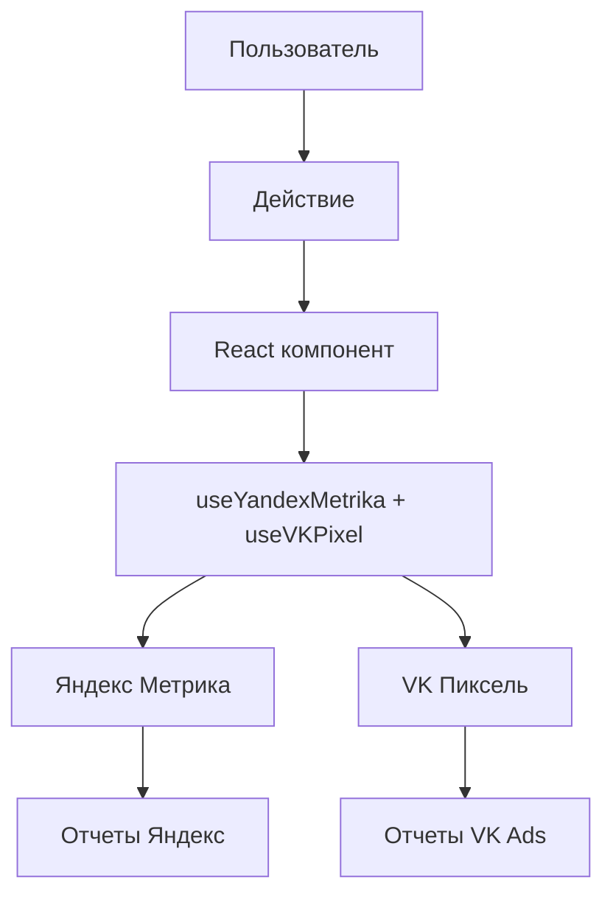

# 🎯 Интеграция VK Пикселя (Top.Mail.Ru) с электронной коммерцией

## 🎯 Обзор реализации

Проект **PizzaNat Web** теперь полностью интегрирован с VK Пикселем (Top.Mail.Ru) для отслеживания электронной коммерции согласно [официальной документации VK](https://ads.vk.com/help/articles/ecomm_web_dynrem).

### ✅ Что реализовано

1. **🎯 Полное соответствие стандарту VK Ads электронной коммерции**
2. **🛒 Автоматическое отслеживание всех действий пользователей**
3. **💰 Детальная аналитика покупок для ретаргетинга**
4. **🔧 TypeScript типизация для всех событий VK**
5. **📊 Параллельная работа с Яндекс.Метрикой**

---

## 🏗️ Архитектура интеграции

### Основные компоненты

```
src/
├── components/analytics/
│   ├── YandexMetrika.tsx          # Яндекс.Метрика
│   └── VKPixel.tsx                # VK Пиксель
├── pages/
│   ├── ProductPage.tsx            # Просмотры и добавления в корзину
│   └── CheckoutPage.tsx           # Начало заказа и покупки
├── contexts/
│   └── ProductsContext.tsx        # Удаление из корзины
└── App.tsx                        # Инициализация провайдеров
```

### Поток данных



---

## 📋 Реализованные события VK

### 1. 👁️ Просмотр товара (view_item)

**Где:** `ProductPage.tsx`  
**Когда:** При загрузке страницы товара

```typescript
// Автоматически отправляется при загрузке товара
const vkProduct = productToVKEcommerce(productData)
trackVKProductView(vkProduct)
```

**Отправляемые данные в VK пиксель:**
```javascript
{
  type: "reachGoal",
  id: "3695469",
  goal: "view_item",
  params: {
    product_id: "1",
    value: 450,
    content_type: "product",
    content_name: "Пицца Маргарита",
    content_category: "Пицца"
  }
}
```

### 2. ➕ Добавление в корзину (add_to_cart)

**Где:** `ProductPage.tsx`  
**Когда:** При нажатии кнопки "Добавить в корзину"

```typescript
// Отслеживается перед API вызовом
const vkProduct = productToVKEcommerce(product, { quantity })
trackVKAddToCart(vkProduct)
```

### 3. ➖ Удаление из корзины (remove_from_cart)

**Где:** `ProductsContext.tsx`  
**Когда:** При удалении товара из корзины

```typescript
// Отслеживается до API вызова
const vkProduct = cartItemToVKEcommerce(cartItem)
trackVKRemoveFromCart(vkProduct)
```

### 4. 🏁 Начало оформления заказа (initiate_checkout)

**Где:** `CheckoutPage.tsx`  
**Когда:** При загрузке страницы оформления заказа

```typescript
// Автоматически при загрузке корзины
const vkProducts = cartItemsToVKEcommerce(cart.items)
trackVKCheckoutStart(vkProducts)
```

### 5. 💳 Завершение покупки (purchase)

**Где:** `CheckoutPage.tsx`  
**Когда:** При успешном создании заказа

```typescript
// После создания заказа через API
const vkProducts = cartItemsToVKEcommerce(cart.items)
trackVKPurchase(vkProducts, order.id.toString())
```

### 6. 💰 Выбор способа оплаты (payment_method_selected)

**Где:** `CheckoutPage.tsx`  
**Когда:** При создании заказа

```typescript
// Отслеживание выбранного метода оплаты
trackVKPaymentMethod(paymentMethod) // 'cash' | 'sbp'
```

---

## 🔧 Техническая реализация

### Основной хук `useVKPixel`

```typescript
const VK_PIXEL_ID = import.meta.env.VITE_VK_PIXEL_ID || '3695469'
const { 
  trackProductView: trackVKProductView,
  trackAddToCart: trackVKAddToCart,
  trackRemoveFromCart: trackVKRemoveFromCart,
  trackCheckoutStart: trackVKCheckoutStart,
  trackPurchase: trackVKPurchase,
  trackPaymentMethodSelected: trackVKPaymentMethod
} = useVKPixel(VK_PIXEL_ID)
```

### Утилиты преобразования данных

```typescript
// Преобразование товара в формат VK
export function productToVKEcommerce(
  product: any,
  options?: {
    quantity?: number
    variant?: string
  }
): VKEcommerceProduct

// Преобразование элемента корзины в формат VK
export function cartItemToVKEcommerce(cartItem: any): VKEcommerceProduct

// Преобразование массива товаров корзины
export function cartItemsToVKEcommerce(cartItems: any[]): VKEcommerceProduct[]
```

### Инициализация в App.tsx

```typescript
const App: React.FC = () => {
  const YANDEX_METRIKA_ID = import.meta.env.VITE_YANDEX_METRIKA_ID || '103585127'
  const VK_PIXEL_ID = import.meta.env.VITE_VK_PIXEL_ID || '3695469'
  
  return (
    <YandexMetrikaProvider counterId={YANDEX_METRIKA_ID}>
      <VKPixelProvider pixelId={VK_PIXEL_ID} enableEcommerce={true}>
        <Router>
          <TelegramProvider>
            <PlatformRouter />
          </TelegramProvider>
        </Router>
      </VKPixelProvider>
    </YandexMetrikaProvider>
  )
}
```

---

## 🧪 Тестирование интеграции

### 1. Проверить в консоли разработчика

```javascript
// Проверить наличие _tmr массива
console.log(window._tmr)

// Показать все VK события
window._tmr
  .filter(event => event.goal)
  .forEach(event => console.log('VK Event:', event))
```

### 2. Использовать инспектор VK

1. Установите расширение [VK Pixel Helper](https://chrome.google.com/webstore/) (если доступно)
2. Откройте сайт с включенным VK пикселем
3. Выполните тестовые действия
4. Проверьте отправку событий

### 3. Проверить Network запросы

1. Откройте DevTools → Network
2. Фильтр: `top-fwz1.mail.ru`
3. Выполните действия на сайте
4. Проверьте отправку событий в реальном времени

### 4. Логирование в development

```typescript
// В development режиме показывает предупреждение
if (import.meta.env.DEV) {
  console.log('🔍 VK Пиксель: Development режим - аналитика отключена')
}

// Логирование отправленных событий
console.log('🎯 VK Goal:', goal, params)
```

---

## 📊 Настройка в VK Ads

### 1. Создание событий

В интерфейсе VK Ads → Инструменты → Пиксели → События:

1. **view_item** - Просмотр товара
2. **add_to_cart** - Добавление в корзину
3. **remove_from_cart** - Удаление из корзины
4. **initiate_checkout** - Начало оформления
5. **purchase** - Покупка
6. **payment_method_selected** - Выбор оплаты

### 2. Настройка динамического ретаргетинга

Для работы динамического ретаргетинга в VK Ads необходимо:

1. Загрузить каталог товаров в формате [VK Products Feed](https://ads.vk.com/help/articles/product_catalogs)
2. Настроить соответствие `product_id` между сайтом и каталогом
3. Создать аудитории на основе событий
4. Запустить динамические кампании

### 3. Рекомендуемые аудитории

```javascript
// Аудитории для ретаргетинга
- "Просматривали товары" (view_item, 30 дней)
- "Добавляли в корзину" (add_to_cart, 7 дней)  
- "Начали оформление" (initiate_checkout, 3 дня)
- "Покупали" (purchase, 180 дней) - для исключения
```

---

## 🚀 Внедрение в production

### 1. Переменные окружения

```bash
# В .env файле должен быть указан ID пикселя
VITE_VK_PIXEL_ID=3695469
```

### 2. Проверка в production режиме

```bash
# VK Пиксель отключен в development режиме
# Для тестирования используйте production сборку
npm run build
npm run preview
```

### 3. Безопасность

- VK Пиксель работает только по HTTPS
- ID пикселя не является секретным и может быть публичным
- Данные передаются только на разрешенные домены VK

---

## 📈 Ожидаемые метрики

### Ключевые показатели VK Ads

1. **CTR (Click-Through Rate)** - улучшение за счет ретаргетинга
2. **Конверсия в покупку** - отслеживание по воронке:
   - Просмотр товара → Добавление в корзину: 15-25%
   - Добавление в корзину → Начало оформления: 60-80%
   - Начало оформления → Покупка: 70-90%
3. **ROAS (Return on Ad Spend)** - окупаемость рекламных затрат
4. **CPA (Cost per Action)** - стоимость конверсии

### Сравнение с Яндекс.Метрикой

| Метрика | Яндекс.Метрика | VK Ads |
|---------|----------------|---------|
| Просмотры товаров | Enhanced Ecommerce | view_item |
| Добавления в корзину | add event | add_to_cart |
| Покупки | purchase event | purchase |
| Ретаргетинг | Яндекс.Директ | VK Ads |

---

## 🔍 Отладка и устранение проблем

### Частые проблемы

1. **Данные не поступают в VK Ads**
   - Проверьте корректность ID пикселя
   - Убедитесь что сайт работает по HTTPS
   - Проверьте блокировку рекламы в браузере

2. **Неверные product_id в событиях**
   - Проверьте функции преобразования в `VKPixel.tsx`
   - Убедитесь что ID товаров соответствуют каталогу

3. **Дублирование событий**
   - VK Пиксель и Яндекс.Метрика работают независимо
   - Проверьте, что компоненты не рендерятся дважды

### Отладочная информация

```typescript
// В консоли браузера
console.log('VK Pixel ID:', VK_PIXEL_ID)
console.log('VK Events:', window._tmr.filter(e => e.goal))

// Проверка загрузки скрипта
console.log('VK Script loaded:', !!document.querySelector('#tmr-code'))
```

---

## 📚 Полезные ссылки

### Документация VK

- [Динамический ретаргетинг в VK Ads](https://ads.vk.com/help/articles/ecomm_web_dynrem)
- [Создание каталога товаров](https://ads.vk.com/help/articles/product_catalogs)
- [События электронной коммерции](https://ads.vk.com/help/articles/pixel_events)

### Инструменты

- [VK Ads Кабинет](https://ads.vk.com/)
- [Справка по пикселям VK](https://ads.vk.com/help/articles/pixel)
- [Top.Mail.Ru Счетчики](https://top.mail.ru/)

---

## ⚖️ Сравнение интеграций

| Параметр | Яндекс.Метрика | VK Пиксель |
|----------|----------------|------------|
| **Формат данных** | Google Enhanced Ecommerce | VK Events API |
| **Передача данных** | window.dataLayer | window._tmr |
| **ID товаров** | Строка | Строка/Массив |
| **Валюта** | RUB в ecommerce | VALUE в числовом формате |
| **Назначение** | Веб-аналитика | Рекламный ретаргетинг |
| **Аудитории** | Яндекс.Директ | VK Ads |

---

## 🎯 Заключение

Интеграция VK Пикселя позволяет:

1. **📊 Получать полную картину** поведения пользователей в VK Ads
2. **🎯 Создавать точные аудитории** для ретаргетинга  
3. **💰 Оптимизировать рекламные кампании** на основе данных
4. **📈 Увеличивать ROAS** за счет персонализации рекламы
5. **🔄 Работать параллельно** с Яндекс.Метрикой без конфликтов

Интеграция полностью готова к использованию в production и соответствует лучшим практикам VK Ads.

---

**Автор:** AI Assistant  
**Дата:** 2025-01-24  
**Версия:** 1.0  
**Статус:** ✅ Готово к production
