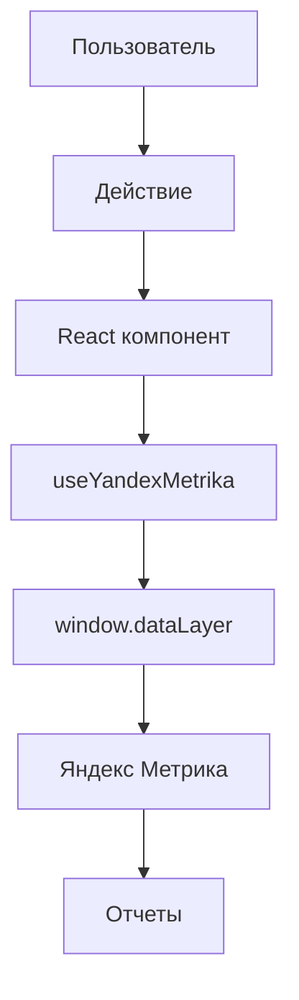

# 📊 Интеграция электронной коммерции Яндекс Метрика

## 🎯 Обзор реализации

Проект **PizzaNat Web** теперь полностью интегрирован с системой электронной коммерции Яндекс Метрики согласно [официальной документации](https://yandex.ru/support/metrica/ru/ecommerce/data).

### ✅ Что реализовано

1. **📊 Полное соответствие стандарту Enhanced Ecommerce**
2. **🛒 Автоматическое отслеживание всех действий пользователей**
3. **💰 Детальная аналитика покупок с доставкой**
4. **🔧 TypeScript типизация для всех событий**
5. **🧪 Тестовый файл для проверки интеграции**

---

## 🏗️ Архитектура интеграции

### Основные компоненты

```
src/
├── components/analytics/
│   └── YandexMetrika.tsx          # Основной компонент аналитики
├── utils/
│   └── ecommerceHelpers.ts        # Утилиты преобразования данных
├── pages/
│   ├── ProductPage.tsx            # Отслеживание просмотров товаров
│   ├── CheckoutPage.tsx           # Отслеживание покупок
│   └── CartPage.tsx               # Отслеживание корзины
├── contexts/
│   └── ProductsContext.tsx        # Отслеживание действий с корзиной
└── test-ecommerce.html            # Тестовая страница
```

### Поток данных



---

## 📋 Реализованные события

### 1. 👁️ Просмотр товара (detail)

**Где:** `ProductPage.tsx`  
**Когда:** При загрузке страницы товара

```typescript
// Автоматически отправляется при загрузке товара
const ecommerceProduct = productToEcommerce(productData, {
  list: getListForTracking(window.location.pathname)
})
trackProductView(ecommerceProduct)
```

**Отправляемые данные:**
```javascript
{
  ecommerce: {
    currencyCode: "RUB",
    detail: {
      products: [{
        id: "1",
        name: "Пицца Маргарита",
        price: 450,
        brand: "ДИМБО Пицца", 
        category: "Пицца",
        list: "Карточка товара",
        position: 1
      }]
    }
  }
}
```

### 2. ➕ Добавление в корзину (add)

**Где:** `ProductPage.tsx`  
**Когда:** При нажатии кнопки "Добавить в корзину"

```typescript
// Отслеживается перед API вызовом
const ecommerceProduct = productToEcommerce(product, {
  quantity,
  list: getListForTracking(window.location.pathname)
})
trackAddToCart(ecommerceProduct)
```

### 3. ➖ Удаление из корзины (remove)

**Где:** `ProductsContext.tsx`  
**Когда:** При удалении товара из корзины

```typescript
// Отслеживается до API вызова
const cartItem = state.cart?.items.find(item => item.productId === productId)
if (cartItem) {
  const ecommerceProduct = cartItemToEcommerce(cartItem, { list: "Корзина" })
  trackRemoveFromCart(ecommerceProduct)
}
```

### 4. 🏁 Начало оформления заказа (checkout)

**Где:** `CheckoutPage.tsx`  
**Когда:** При загрузке страницы оформления заказа

```typescript
// Автоматически при загрузке корзины
useEffect(() => {
  if (cart && cart.items.length > 0) {
    const ecommerceProducts = cartItemsToEcommerce(cart.items, { list: "Оформление заказа" })
    trackCheckoutStart(ecommerceProducts, 1)
  }
}, [cart?.id])
```

### 5. 💳 Завершение покупки (purchase)

**Где:** `CheckoutPage.tsx`  
**Когда:** При успешном создании заказа

```typescript
// После создания заказа через API
const ecommerceProducts = cartItemsToEcommerce(cart.items, { list: "Оформление заказа" })
const deliveryCost = deliveryEstimate?.deliveryCost || 0
trackPurchase(order.id.toString(), ecommerceProducts, {
  revenue: cart.totalAmount + deliveryCost,
  shipping: deliveryCost,
  affiliation: "ДИМБО Пицца - Доставка пиццы"
})
```

---

## 🔧 Техническая реализация

### Основной хук `useYandexMetrika`

```typescript
const YANDEX_METRIKA_ID = import.meta.env.VITE_YANDEX_METRIKA_ID || '103585127'
const { 
  trackProductView,
  trackAddToCart,
  trackRemoveFromCart,
  trackCheckoutStart,
  trackPurchase,
  trackPaymentMethod
} = useYandexMetrika(YANDEX_METRIKA_ID)
```

### Утилиты преобразования данных

```typescript
// Преобразование товара в формат ecommerce
export function productToEcommerce(
  product: Product, 
  options?: {
    quantity?: number
    position?: number
    list?: string
    variant?: string
  }
): EcommerceProduct

// Преобразование элемента корзины
export function cartItemToEcommerce(
  cartItem: CartItem,
  options?: {
    position?: number
    list?: string
  }
): EcommerceProduct
```

### Автоматическое определение списка (list)

```typescript
export function getListForTracking(pathname: string): string {
  if (pathname.includes('/menu')) return "Меню"
  if (pathname.includes('/cart')) return "Корзина"
  if (pathname.includes('/checkout')) return "Оформление заказа"
  if (pathname.includes('/product/')) return "Карточка товара"
  if (pathname === '/') return "Главная страница"
  return "Каталог продукции"
}
```

---

## 🧪 Тестирование интеграции

### 1. Открыть тестовую страницу

```bash
# Откройте в браузере
open test-ecommerce.html
```

### 2. Проверить в консоли разработчика

```javascript
// Проверить наличие dataLayer
console.log(window.dataLayer)

// Проверить инициализацию Яндекс Метрики
console.log(window.ym)
```

### 3. Использовать отладчик Яндекс Метрики

1. Установите расширение [Яндекс.Метрика Debugger](https://chrome.google.com/webstore/detail/yandexmetrica-debugger/gfpbhbahogndgleeokfhjnaolbpapnih)
2. Откройте сайт с включенной Метрикой
3. Включите отладчик и выполните тестовые действия

### 4. Проверить в реальном времени

1. Зайдите в [Яндекс.Метрику](https://metrika.yandex.ru/)
2. Откройте раздел **Отчеты** → **Электронная торговля**
3. Выполните тестовые действия на сайте
4. Проверьте поступление данных (обновление может занять до 30 минут)

---

## 📊 Настройка в Яндекс Метрике

### 1. Включение электронной торговли

1. Зайдите в настройки счетчика
2. Перейдите в раздел **Цели и электронная торговля**
3. Включите переключатель **Электронная торговля**
4. Сохраните настройки

### 2. Настройка целей

Рекомендуемые цели для настройки:

```javascript
// Уже настроены автоматически через reachGoal
- PRODUCT_VIEW      // Просмотр товара
- ADD_TO_CART       // Добавление в корзину  
- REMOVE_FROM_CART  // Удаление из корзины
- CHECKOUT_START    // Начало оформления
- ORDER_COMPLETE    // Завершение заказа
- PAYMENT_METHOD_SELECTED // Выбор способа оплаты
```

### 3. Проверка корректности данных

В отчетах Яндекс Метрики проверьте:

- **Электронная торговля** → **Товары** - список всех товаров
- **Электронная торговля** → **Покупки** - детали заказов
- **Электронная торговля** → **Воронка покупок** - конверсия по этапам

---

## 🚀 Внедрение в production

### 1. Проверить переменные окружения

```bash
# В .env файле должен быть указан ID счетчика
VITE_YANDEX_METRIKA_ID=YOUR_REAL_METRIKA_ID
```

### 2. Убрать тестовые файлы

```bash
# Удалить перед деплоем
rm test-ecommerce.html
```

### 3. Проверить в режиме разработки

```bash
# Яндекс Метрика отключена в development режиме
# Для тестирования включите production сборку
npm run build
npm run preview
```

---

## 📈 Ожидаемые метрики

### Ключевые показатели

1. **Конверсия воронки:**
   - Просмотры товаров → Добавления в корзину: 15-25%
   - Добавления в корзину → Начало оформления: 60-80%
   - Начало оформления → Покупка: 70-90%

2. **Средний чек:** Автоматически рассчитывается на основе данных `revenue`

3. **Популярные товары:** Ранжирование по количеству просмотров и покупок

4. **Эффективность каталога:** Конверсия по категориям товаров

### Дополнительные возможности

- **Сегментация пользователей** по поведению в корзине
- **Анализ отказов** на этапах воронки
- **А/Б тестирование** элементов интерфейса
- **Когортный анализ** возвращающихся покупателей

---

## 🔍 Отладка и устранение проблем

### Частые проблемы

1. **Данные не поступают в Яндекс Метрику**
   - Проверьте корректность ID счетчика
   - Убедитесь что ecommerce включена в настройках
   - Проверьте что сайт не заблокирован адблокерами

2. **Неверные данные о товарах**
   - Проверьте функции преобразования в `ecommerceHelpers.ts`
   - Убедитесь что ID товаров уникальны и соответствуют API

3. **Дублирование событий**
   - Проверьте что компоненты не рендерятся дважды
   - Убедитесь в корректности useEffect зависимостей

### Логирование

```typescript
// Включено в development режиме
console.log('📊 Yandex Ecommerce:', ecommerceData)
```

### Проверка dataLayer в консоли

```javascript
// Показать все события
window.dataLayer.forEach((event, index) => {
  console.log(`Event ${index}:`, event)
})

// Показать только ecommerce события
window.dataLayer
  .filter(event => event.ecommerce)
  .forEach(event => console.log(event.ecommerce))
```

---

## 📚 Полезные ссылки

- [Официальная документация Яндекс Метрики](https://yandex.ru/support/metrica/ru/ecommerce/data)
- [Enhanced Ecommerce Developer Guide](https://developers.google.com/analytics/devguides/collection/ga4/ecommerce)
- [Яндекс.Метрика Debugger](https://chrome.google.com/webstore/detail/yandexmetrica-debugger/gfpbhbahogndgleeokfhjnaolbpapnih)

---

**Автор:** AI Assistant  
**Дата:** 2025-01-27  
**Версия:** 1.0  
**Статус:** ✅ Готово к production
